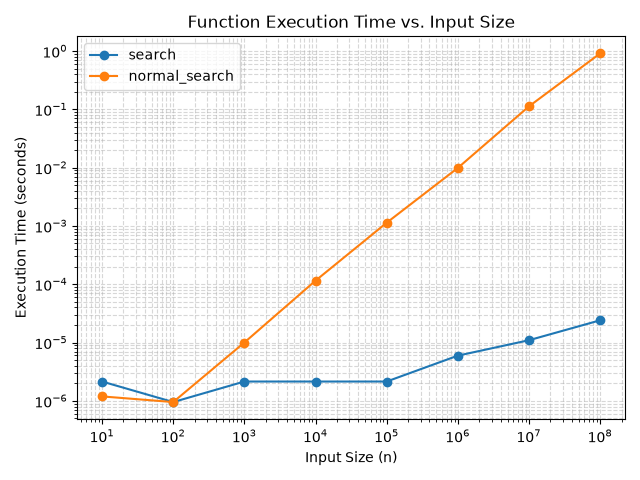

# Binary Search

Compares `BinarySearch.search` (binary search, O(log n)) against `normal_search`
(linear search, O(n)) on sorted lists of increasing size.

## Files

- `algorithm.py` — `BinarySearch.search(list, target)` and `normal_search(list, target)`.
  Both return `(index, attempts)` if found, `None` otherwise, and are wrapped with
  `utils.time_function_decorator_global` so every call records `(input_size, elapsed_time)`.
- `main.py` — runs both searches across a range of list sizes (10 to 100,000,000)
  and plots execution time vs. input size on a log-log scale.

## Run

From the repo root:

```bash
python3 -m binary_search.main
```

This prints the timing/attempt count for each run and opens a plot showing
binary search staying flat while linear search grows linearly with input size:


